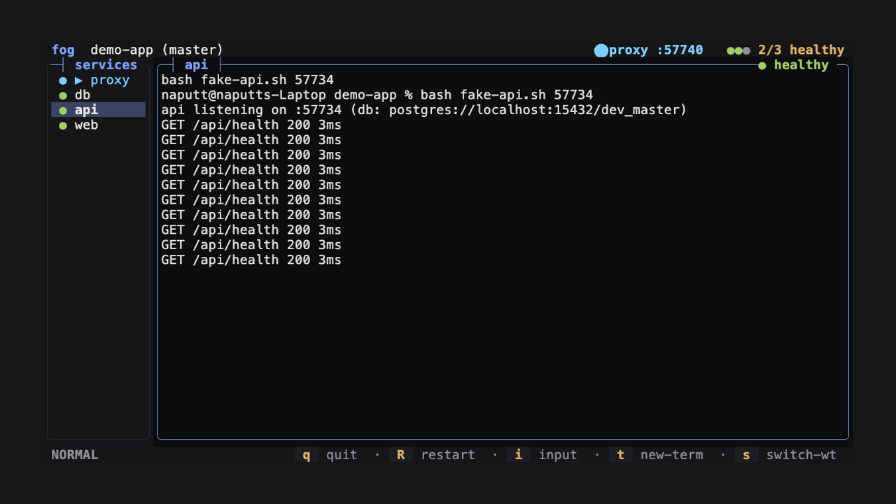
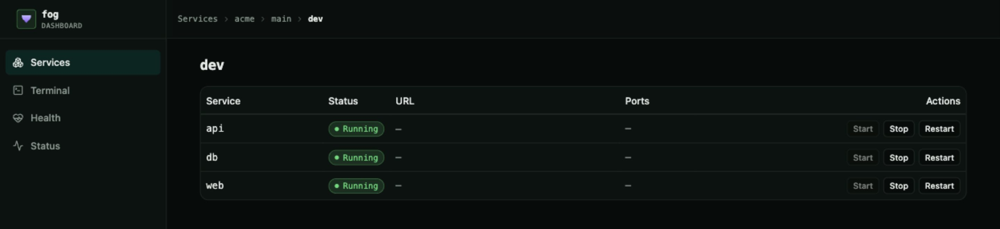
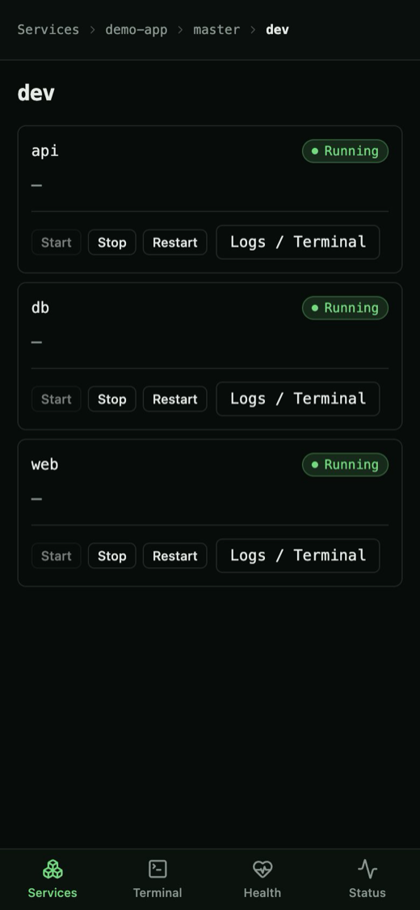

# fog

[](https://github.com/Naputt1/fog/actions/workflows/ci.yml)
[](https://crates.io/crates/fog-tui)
[](LICENSE)

**The dev-environment orchestrator for humans and coding agents.**

You and your agent run the same `fog dev` on the same branch — concurrently, without killing each other. Shared DBs get borrowed instead of duplicated, your agent runs headless while you watch the TUI, and you check both from your phone on the tailnet. Each service runs in its own PTY with full ANSI color and scrollback, behind an optional built-in reverse proxy — all in one `ratatui` terminal UI.

```bash
# Terminal A — you, the TUI
fog dev

# Terminal B — your agent, headless, same branch
fog dev -d
# → shares the DB, streams logs you can watch live
```



<details>
<summary>Watch the demo</summary>


</details>

## Web UI

Every running instance is also served by the host-global index server as a dashboard for your desktop or phone — services and status, live logs, and a web terminal — at `http://127.0.0.1:18080` (or `http://<tailnet IP>` from your phone).

<table>
  <tr>
    <td></td>
    <td></td>
  </tr>
</table>

## Set up fog with your agent

Paste this into your coding agent (Claude Code, Cursor, OpenCode, …) to install fog and write a `fog.json` for the repo:

```text
Install fog if it is missing (cargo install fog-tui), then set it up for this repository.

1. Inspect the repo to find the real services and how they start: package.json scripts, docker-compose files,
   Cargo/Go/Python entrypoints, and the ports each one listens on.
2. Write a fog.json at the repo root with "$schema" set to
   https://raw.githubusercontent.com/Naputt1/fog/main/fog.schema.json and a single "dev" script listing one
   service per process (with a working "path" and "cmd").
3. Apply fog's conventions: declare per-instance ports as "ports": { "api": 0 } and reference them as
   ${ports.api}; give a shared database "share": true plus a "health_check" so concurrent instances borrow it;
   use "depends_on" for start order; and add a "proxy" with routes when the repo serves HTTP.
4. Validate: run `fog dev -d`, then `fog ls` and `fog logs <pid>`; fix any service that fails to become healthy,
   then `fog kill <pid>`.

Read https://naputt1.github.io/fog/configuration and https://naputt1.github.io/fog/agentic before writing the config.
```

This is the same `fog.json` your `fog dev` will run; see the [configuration reference](https://naputt1.github.io/fog/configuration) to edit it by hand.

## Why fog

AI agents changed how we develop, but dev tooling still assumes one human per environment. fog is worktree-aware and **concurrent by default**: run `main` and `feature-x` side-by-side, or the _same_ branch twice — human in the TUI, agent headless — and fog shares healthy services (the DB) while isolating the rest with per-instance ports and `${branch}` templating.

## Features

- **Humans + agents on one environment.** `fog dev` and `fog dev -d` on the same branch coexist: shared DBs are borrowed (`share: true`), ports are randomized per instance, logs stream to the web UI. See the [agentic guide](https://naputt1.github.io/fog/agentic).
- **Branches side-by-side.** Run `fog dev` on `main` and `feature-x` at once; `s` switches worktrees in-place in the TUI. Same branch can run twice — you and an agent share the DB without killing each other.
- **Phone overview.** Check status and live logs at `http://<tailnet IP>` from your phone — no DNS setup.
- **Web terminal.** A live ANSI-color shell per service at `/ws/terminal`, bridged through the proxy and hardened with a per-script `terminal` config block.
- **One command per service.** Each service in its own PTY with color and scrollback. `health_check`, `depends_on`, restart with `R`.
- **Built-in proxy.** Reverse proxy with request log, filter, and WebSocket support.
- **Simple config.** One `fog.json` with named scripts (`fog dev`). Ports templating, native_routes, worktree-aware sharing.
- **Endpoints.** Declare what each service exposes (`endpoint`) — one for most, several for a compose stack — and get generated routes plus per-endpoint health in the web UI.

Full docs: [configuration](https://naputt1.github.io/fog/configuration), [agentic guide](https://naputt1.github.io/fog/agentic), [index server](https://naputt1.github.io/fog/index-server).

## Installation

```bash
# from source
git clone https://github.com/Naputt1/fog.git && cd fog
cargo build --release  # -> target/release/fog

# from crates.io
cargo install fog-tui  # installs binary `fog`

# from git
cargo install --git https://github.com/Naputt1/fog.git
cargo install --git https://github.com/Naputt1/fog.git --tag v0.1.3
```

If `ui/dist` is absent on a git install, `build.rs` fetches the prebuilt SPA from the GitHub Release. For offline builds use `FOG_SKIP_SPA_DOWNLOAD=1`. Use `FOG_REQUIRE_SPA=1` to fail the build instead of embedding the fallback page.

Windows 10 build 17763 (October 2018) or newer is supported; see the [Windows notes](https://naputt1.github.io/fog/troubleshooting#windows-support) for the few platform differences.

### Local rebuild

After changing the UI or Rust sources, rebuild the SPA, recompile, and replace the installed `fog` in one step:

```bash
scripts/reinstall.sh             # build ui/ + cargo --release, swap the binary in place
scripts/reinstall.sh --skip-ui   # Rust only (reuse the current ui/dist)
scripts/reinstall.sh --restart   # also restart the running index server so the new UI is live
```

A running index server keeps serving its old embedded SPA until restarted, so the script warns when it detects one. Pass `--restart` to kill the detected index server(s) and respawn them from the new binary (safe; the dashboard re-attaches on the next request).

## Quick start

Create `fog.json`:

```json
{
  "scripts": {
    "dev": {
      "service": [
        { "name": "web", "path": "/path/to/project", "cmd": "npm run dev" }
      ]
    }
  }
}
```

```bash
fog dev
```

For wildcard hostnames like `main.acme` and Traefik routing on `:80`, see [DNS and routing setup](https://naputt1.github.io/fog/configuration#dnsmasq) and the [configuration reference](https://naputt1.github.io/fog/configuration).

Web UI and API run on `127.0.0.1:18080` by default when enabled; control the host-global server with `fog index serve|kill|restart`. See [configuration](https://naputt1.github.io/fog/configuration#index) for the index server, SPA build, and API.

## Web terminal

The web UI includes a live terminal at `/ws/terminal` that bridges your browser
to a PTY shell (via the built-in reverse proxy). Open the service's terminal
tab in the UI for a full ANSI-color shell.

The gateway is served before route matching and can be hardened per script with
a `terminal` config block:

```json
{
  "scripts": {
    "dev": {
      "service": [{ "name": "web", "path": "/path", "cmd": "npm run dev" }],
      "proxy": { "port": 8080, "routes": [] },
      "terminal": {
        "auth_token": "s3cret",
        "max_sessions_per_ip": 8,
        "max_message_bytes": 65536,
        "idle_timeout_secs": 900
      }
    }
  }
}
```

When `auth_token` is set, the client must connect with
`/ws/terminal?auth_token=<token>`; missing or wrong tokens are rejected with
`401`. Sessions are capped per client IP (`429`), oversized frames close with
code `1009`, and PTY output is buffered in a bounded 64-frame drop-oldest
queue. See the [terminal protocol](https://naputt1.github.io/fog/terminal-protocol)
for full details.

## Usage

```bash
fog <script> [OPTIONS]        # run a script (e.g. fog dev)
fog ls                        # list running instances, project/branch and service status
fog restart [pid]             # restart a running instance
fog kill [pid]                # gracefully shut down
fog kill --all                # every instance from this config (or every instance, outside a fog.json dir)
fog kill [pid] --force        # escalate SIGTERM → SIGKILL for a wedged instance
fog logs [pid]                # list services and their status
fog logs [pid] -s <name>      # print captured output of one service
fog logs [pid] -s <name> --tail 50   # last 50 lines (--head 50, --head -50, --tail +51)
fog attach [pid]              # reattach the TUI to a running instance (replays screen history)
fog index serve|kill|restart  # control the host-global web UI / API server
```

| Option                   | Description                                                                                                     |
| ------------------------ | --------------------------------------------------------------------------------------------------------------- |
| `-c`, `--config <PATH>`  | Path to config file or directory containing `fog.json` (default `fog.json`)                                     |
| `--branch <BRANCH>`      | Run in the git worktree for this branch                                                                         |
| `--port <NAME=PORT>`     | Override a top-level `ports` entry for this run (repeatable; `0` re-randomizes, e.g. `fog dev --port api=4000`) |
| `-d`, `--detach`         | Run in background without TUI, captures logs to `$TMPDIR/fog-<pid>.logs/`                                       |
| `--no-share`             | Ignore `share:`/`reuse:` — start fresh even when a healthy sibling could be borrowed                            |
| `--all`                  | With `fog kill`/`fog restart`: apply to every matching instance (conflicts with `PID`)                          |
| `--force`                | With `fog kill`/`fog restart`: escalate to SIGTERM then SIGKILL for a wedged instance                           |
| `-s`, `--service <NAME>` | With `fog logs`: show one service instead of listing (`daemon` and `proxy` included)                            |
| `--head <N\|-N>`         | With `fog logs -s`: keep the first `N` lines, or all but the last `N` with `-N`                                 |
| `--tail <N\|-N\|+N>`     | With `fog logs -s`: keep the last `N` lines, or from line `N` to the end with `+N`                              |
| `--save-logs`            | Save service output to `temp/<name>.txt` on exit                                                                |
| `-v`, `--verbose`        | Print informational setup output (DNS, router, index, ports, native routes); warnings always print              |
| `--completions <SHELL>`  | Print bash/zsh/fish completions                                                                                 |

`fog ls` prints one row per instance — `pid script project branch proxy` — with a `service`/`status` sub-table beneath each (`healthy`, `starting`, `unhealthy`, `unknown`, or `stopped`).

Each instance exposes a Unix socket at `$TMPDIR/fog-<pid>.sock`. `fog ls` and `fog kill` discover it there. Pass a PID when multiple instances run.

Override an allocated port for one run without editing `fog.json`:

```bash
fog dev --port api=4000 --port web=0   # pin api, re-randomize web
```

`--port` is repeatable and applies before `${ports.*}` templating, so services, endpoint routes and native routes all use the overridden value. A name not declared in the config's `ports` map is added for that run.

Docs: [https://naputt1.github.io/fog/](https://naputt1.github.io/fog/) for configuration, proxy, themes, keybindings, architecture and troubleshooting.

## Keybindings

| Key                                           | Action                                                                                    |
| --------------------------------------------- | ----------------------------------------------------------------------------------------- |
| `q` / `Ctrl+q`                                | Quit                                                                                      |
| `j` / `→` / `Ctrl+n`                          | Next tab                                                                                  |
| `k` / `←` / `Ctrl+p`                          | Previous tab                                                                              |
| `i`                                           | Enter terminal input (`Esc` to exit)                                                      |
| `R`                                           | Restart current service or proxy                                                          |
| `t` / `Ctrl+t`                                | Open a shell tab                                                                          |
| `x`                                           | Close the current shell tab                                                               |
| `d`                                           | Detach: close the TUI but keep the session running                                        |
| `s`                                           | Worktree switch popup (`f` fuzzy search, `Enter` to switch, `d` to terminate that branch) |
| `↑` / `↓` · `PageUp` / `PageDown` · `g` / `G` | Scroll                                                                                    |
| `/`                                           | Filter proxy logs                                                                         |
| `?`                                           | Toggle help overlay                                                                       |

Mouse: click a sidebar tab to switch, click a bottom-right alert to copy its message, click its ✕ to dismiss, drag-select to copy (OSC 52), scroll wheel to scroll.

Full reference in [keybindings](https://naputt1.github.io/fog/keybindings).

## License

MIT
